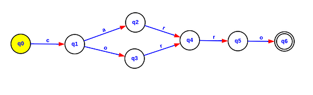

# Finite Automata


## About

Simple implementation of infinite automata to resolve regex expression c(a|o)rro




How to run 

```golang
go main.go
```

Expected output

```golang
Accepted String: carro 
Rejected String: casa
Accepted String: corro
```


